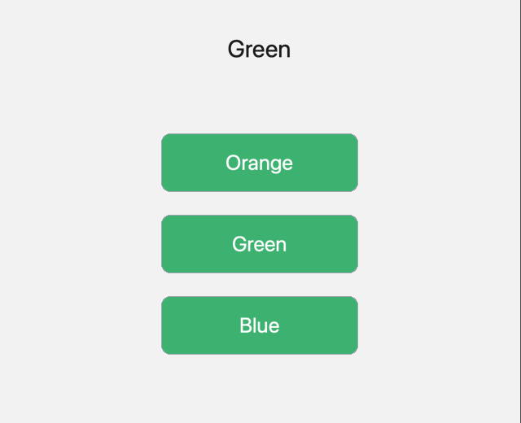

# DMC Corona UI

Widgets for Solar2D (formerly Corona SDK): buttons, text, text fields, backgrounds, navigation bars, scroll and table views, each drawn from a style you can share, cascade and swap as a theme.

Every widget takes its look from a Style object. Give it the style inline, as a shared object, or by name; change the style, and every widget using it redraws:

```lua
local dUI = require 'lib.dmc_ui'

dUI.newButtonStyle{ name='big-button', width=240, height=70 }

local button = dUI.newPushButton{
	labelText="Save",
	style='big-button',
	onRelease=function( event ) print( 'saved' ) end,
}
```

## Features

- Text, text field, push, radio and toggle buttons, backgrounds (rectangle, rounded, 9-slice, image), navigation bar, scroll view and table view
- Any property can be changed at any time, including those Solar2D's own objects fix at creation (a text's font, a text field's size)
- Styles cascade: a style inherits every property it doesn't set from another one
- Named styles, usable anywhere in the app by name, and themes: sets of named styles you switch at run time
- A Navigation Control: a navigation bar with a back button over a stack of views you push and pop
- Text shrinks to its content or truncates with an ellipsis; a text field shows styled text until it is edited
- Pure Lua, no plugins needed; MIT licensed

## Quick Start

The following code will get you up and running in about 10 minutes in the Solar2D Simulator on macOS or Windows. It makes a text and a button, then three buttons that share a named style.

Prerequisites: the [Solar2D](https://solar2d.com/) Simulator and a copy of this repository (`git clone https://github.com/dmccuskey/DMC-Corona-UI.git`, or download the ZIP from GitHub).

### 1. Copy the Library into Your Project

Copy these from this repository into the root of your project folder:

```text
dmc_corona_boot.lua     loader for the DMC libraries
dmc_corona.cfg          configuration: says the libraries are in lib/dmc_corona/
lib/
├── dmc_ui.lua          the module you require
├── dmc_ui/             the widgets, styles and controls
└── dmc_corona/         the DMC libraries DMC Corona UI uses
```

**Going further:** keep the libraries somewhere else, or combine several DMC libraries ([dmc-corona-boot Configuration](https://github.com/dmccuskey/dmc-corona-boot/blob/master/docs/configuration.md)).

### 2. A Text and a Button

Create `main.lua` in the project folder:

```lua
local dUI = require 'lib.dmc_ui'

local W, H = display.contentWidth, display.contentHeight
display.setDefault( 'background', 0.95 )

local title = dUI.newText{
	text="Hello, DMC UI",
	style={ width=280, height=40, fontSize=24, textColor={ 0.1, 0.1, 0.1 } }
}
title.x, title.y = W/2, 80

local count = 0

local button = dUI.newPushButton{
	labelText="Press Me",
	style={
		width=160, height=50,
		inactive={
			label={ textColor={ 1, 1, 1 } },
			background={ type='rounded', view={ fillColor=dUI.Palette.blue } },
		},
		active={
			label={ textColor={ 1, 1, 1 } },
			background={ type='rounded', view={ fillColor=dUI.Palette.blueDark } },
		},
	},
	onRelease=function( event )
		count = count + 1
		title.text = "Pressed " .. count .. " times"
	end,
}
button.x, button.y = W/2, 200
```

Open the project in the Simulator. A title is at the top, a blue button below it. Click the button: it turns dark blue while pressed, and the title counts the presses.

The `style` tables hold everything about the look. A button has one set for each state (`inactive`, `active` while pressed, `disabled`), each with a `label` (a text style) and a `background` (a background style, here `rounded`). Anything left out comes from the default style.

If the console shows `module 'lib.dmc_ui' not found` instead, `lib/` is missing from the root of the project folder. `module 'dmc_events_mix' not found` means `dmc_corona.cfg` is missing there.

### 3. Share a Style by Name

Replace `main.lua` with this. The buttons now use a named style, and each one changes that style when pressed:

```lua
local dUI = require 'lib.dmc_ui'

local W, H = display.contentWidth, display.contentHeight
display.setDefault( 'background', 0.95 )

-- a named style: any button can use it by its name
local bigButton = dUI.newButtonStyle{
	name='big-button',
	width=240, height=70,
	inactive={
		label={ fontSize=26, textColor={ 1, 1, 1 } },
		background={ type='rounded', view={ cornerRadius=10, fillColor=dUI.Palette.blue } },
	},
	active={
		label={ fontSize=26, textColor={ 1, 1, 1 } },
		background={ type='rounded', view={ cornerRadius=10, fillColor=dUI.Palette.slate } },
	},
}

local status = dUI.newText{
	text="Pick a color",
	style={ width=400, height=50, fontSize=30, textColor={ 0.1, 0.1, 0.1 } }
}
status.x, status.y = W/2, 120

local function newColorButton( label, color, y )
	local button = dUI.newPushButton{
		labelText=label,
		style='big-button',
		onRelease=function( event )
			-- change the named style: every button using it follows
			bigButton.inactive.background.view.fillColor = color
			status.text = label
		end,
	}
	button.x, button.y = W/2, y
	return button
end

newColorButton( "Orange", dUI.Palette.orange, 260 )
newColorButton( "Green", dUI.Palette.green, 360 )
newColorButton( "Blue", dUI.Palette.blue, 460 )
```

The Simulator restarts the app when the file is saved. Three blue buttons share the style `big-button`. Click Green: all three turn green, and the text says which one you picked.



Each button gets its own copy of the style, which inherits from `big-button`: change `big-button` and they all change; change `button.style` and only that button does ([Using Styles](docs/styles.md)).

**Going further:** make a set of named styles into a theme and switch themes at run time ([Themes](docs/styles.md#themes)), put a navigation bar over your screens ([Navigation Control](docs/controls.md)), or see complete apps in [examples](examples/).

To update, copy `dmc_corona_boot.lua` and `lib/` again from the newer version. Keep your own `dmc_corona.cfg` if you have changed it.

## Documentation

- [Using Styles](docs/styles.md): styles and widgets, inline, shared and named styles, child styles, inheritance, themes, the palette
- [Widgets](docs/widgets.md): each widget's options, properties, methods and events
- [Controls](docs/controls.md): the Navigation Control, and a control shown as a page over the app or as a popover
- [API reference](docs/api.md): the module's functions, constants, configuration, known issues
- [Examples](examples/): an app for each widget and control

Everything else is listed on the [documentation home](docs/README.md).

## License

DMC Corona UI is released under the [MIT License](LICENSE).
