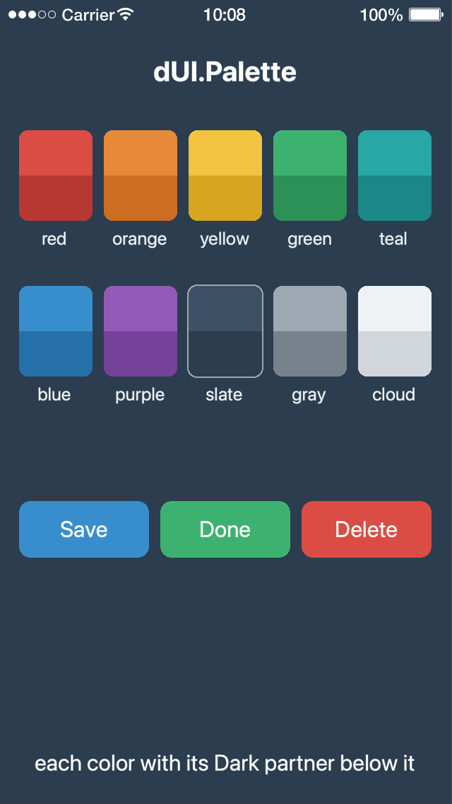

# Using Styles

Everything a DMC Corona UI widget draws comes from its style: size, anchor, colors, fonts, margins, background. The widget itself holds only its content (the text, the button label) and its position. This page explains how to give a widget a style, share one between widgets, and change a whole app's look at once.

The examples assume:

```lua
local dUI = require 'lib.dmc_ui'
```

## A Style for Each Widget

Each widget type has its own style type, and takes only that type:

| Widget | Style constructor |
|---|---|
| `newText()` | `newTextStyle()` |
| `newTextField()` | `newTextFieldStyle()` |
| `newButton()`, `newPushButton()`, `newRadioButton()`, `newToggleButton()` | `newButtonStyle()` |
| `newBackground()` and its variants | `newBackgroundStyle()` and its variants |
| `newNavBar()`, `newNavItem()` | `newNavBarStyle()`, `newNavItemStyle()` |
| `newScrollView()`, `newSlideView()` | `newScrollViewStyle()` |
| `newPageIndicator()` | `newPageIndicatorStyle()` |
| `newTableView()` | `newTableViewStyle()` |
| `newTableViewCell()` | `newTableViewCellStyle()` |

A widget always has a style: without one, it uses the default style of its type. The properties each style takes are listed with its widget in [Widgets](widgets.md).

A style is a set of properties, given as a table:

```lua
local style = dUI.newTextStyle{
	width=200, height=40,
	align='left',
	font=native.systemFont,
	fontSize=16,
	marginX=10,
	textColor={ 0, 0, 0 },
}
```

Colors are tables of 0 to 1 values, `{ r, g, b [, a] }`, or hex strings such as `'#bfaf80'` (read by [dmc-kolor](https://github.com/dmccuskey/dmc-kolor)). A property the style doesn't set comes from the style it inherits from, in the end the default style ([Inheritance](#inheritance)). A property a style type doesn't know is skipped, with a `[NOTICE] Skipping invalid style property` line on the console.

## Giving a Widget a Style

There are three ways.

**Inline**: a table in the widget's `style` option. The widget gets a style of its own, made from the table. Quick to write, but nothing else can use it:

```lua
local text = dUI.newText{
	text="Big Title",
	style={ fontSize=30, textColor={ 0.2, 0.2, 0.6 } },
}
```

**A style object**: made once, given to any number of widgets, in the constructor or later through the `style` property:

```lua
local titleStyle = dUI.newTextStyle{ fontSize=30 }

local text1 = dUI.newText{ text="One", style=titleStyle }

local text2 = dUI.newText{ text="Two" }
text2.style = titleStyle
```

**By name**: a style with a `name` is registered and can be used by that name anywhere in the app, without passing the object around:

```lua
-- in one file
dUI.newTextStyle{ name='title', fontSize=30 }

-- in another
local text = dUI.newText{ text="Big Title", style='title' }
-- or later: text.style = 'title'
```

Names are kept per style type: a text style and a button style can both be called `'title'`. A second style with a name already in use isn't registered (`[NOTICE] StyleMgr.addStyle already have style with name`). `dUI.getStyle( 'Text', 'title' )` returns a named style, `dUI.removeStyle( 'Text', 'title' )` unregisters one, and so do setting its `name` to `nil` and removing the style (`removeSelf()`). The type names are `'Background'`, `'Button'`, `'NavBar'`, `'Text'`, `'TextField'` and so on (a style's `TYPE`).

`widget.style = nil` puts the widget back on the default style.

## What the Widget Holds

A widget never uses the style you give it directly. It makes a new, empty style that inherits from yours, and uses that one; `widget.style` returns it. So:

- Changing the style you gave (`titleStyle.fontSize = 24`, or the named style) changes every widget that uses it.
- Changing `widget.style` (`text1.style.fontSize = 24`) changes only that widget.

The Quick Start's [step 3](../README.md#3-share-a-style-by-name) shows both.

## Changing a Style

Set any property, at any time; the widgets using the style redraw:

```lua
text.style.textColor = { 1, 1, 1 }
text.style.fillColor = { 0.2, 0.2, 0.2 }
```

Many widgets also have helpers, properties and methods on the widget that set its own style. These two lines do the same:

```lua
text:setTextColor( 1, 1, 1 )
text.style.textColor = { 1, 1, 1 }
```

The helpers each widget has are listed in [Widgets](widgets.md). Going through `style` always works, helper or not.

## Child Styles

Some styles contain other styles, each for a part of the widget:

| Style | Children |
|---|---|
| Background | `view`: the drawing, whose properties depend on the background `type` |
| Button | `inactive`, `active`, `disabled`: one for each state, each with a `label` (text style) and a `background` |
| Text Field | `background`, `hint` (text style for the hint), `display` (text style for the text) |
| Nav Bar | `background` |
| Nav Item | `title`, `backButton`, `leftButton`, `rightButton` |
| Table View Cell | `inactive`, `active`: one for each state (`active` while the row is touched), each with a `label` and a `detail` (text styles), a `background`, and `labelY` and `detailY`, where the two lines of text sit |

Give children as nested tables, and reach them through the parent:

```lua
local field = dUI.newTextField{
	hintText="Email",
	style={
		width=300, height=50,
		hint={ fontSize=18, textColor={ 0.5, 0.5, 0.5 } },
		display={ fontSize=18, textColor={ 0, 0, 0 } },
	},
}

field.style.background.view.cornerRadius = 2
field.style.hint.fontSize = 24
field.style.display.textColor = { 1, 0, 1, 0.5 }
```

When a style inherits from another ([Inheritance](#inheritance)), each of its children inherits from the same child there: a button style's `active` from the other style's `active`.

## Inheritance

Styles cascade: a style gets every property it doesn't set from the style it inherits from, and that one from its own, up to the default style of the type. Set `inherit` to another style of the same type, or to a style's name:

```lua
local body = dUI.newTextStyle{ name='body', fontSize=18, textColor={ 0.1, 0.1, 0.1 } }

local note = dUI.newTextStyle{ inherit=body, fontSize=14 }   -- or: inherit='body'
```

`note` now has `body`'s color at its own size. Change `body.textColor`, and every widget using `note` changes too.

`inherit` works in an inline style too: `style={ inherit='body', fontSize=14 }`. A name must belong to a style of the same type that already exists, or making the style raises an error.

Setting `note.inherit` later changes only where the missing properties come from: the properties `note` sets itself stay, and its widgets redraw. `note:clearProperties()` drops them, back to everything inherited. Setting `inherit` to `nil` inherits from the default style again, and so does a style whose `inherit` is removed (`removeSelf()`). A background style keeps its own `type` too; when the change gives it another view type, its `view` starts over, as view properties belong to a type.

## Palette

`dUI.Palette` is a small set of colors which go together, for an app's own styles. The library's default styles are drawn from its `slate`, `gray` and `cloud`.



| Color | Partner | Meant for |
|---|---|---|
| `red`, `orange`, `yellow`, `green`, `teal`, `blue`, `purple` | `redDark`, `orangeDark`, ... `purpleDark` | a button, a panel, a slide; white text reads on them (dark text on `yellow`) |
| `slate` | `slateDark` | dark surfaces: a page's backdrop, a pressed button |
| `gray` | `grayDark` | borders, disabled text |
| `cloud` | `cloudDark` | light surfaces, text on a dark one |

Each is a table `{ r, g, b }` of 0 to 1 values, so it goes wherever a style takes a color, and `unpack()` hands it to a plain display object. The `Dark` partner is the same hue a step darker, for a pressed state or a border:

```lua
local Palette = dUI.Palette

local button = dUI.newPushButton{
	labelText="Save",
	style={
		inactive={
			label={ textColor={ 1, 1, 1 } },
			background={ view={ fillColor=Palette.blue, strokeWidth=0 } },
		},
		active={
			label={ textColor={ 1, 1, 1 } },
			background={ view={ fillColor=Palette.blueDark, strokeWidth=0 } },
		},
	},
}

local backdrop = display.newRect( display.contentCenterX, display.contentCenterY, display.actualContentWidth, display.actualContentHeight )
backdrop:setFillColor( unpack( Palette.slateDark ) )
backdrop:toBack()
```

For a translucent color, copy the values and add the alpha: `{ 0.22, 0.56, 0.80, 0.5 }`. The tables are shared: don't change one in place. The palette is apart from dmc-kolor's color names (`'blue'` in a style is still the CSS blue, when the app loads a named-color file).

## Themes

A theme is a set of named styles, kept apart from the other named styles, that can be swapped for another set while the app runs. While a theme is active, a style name is looked up in the theme first, then among the other named styles. Widgets that use a style by name redraw when the active theme changes.

A theme is usually written in its own file, a module with an `initialize()` function:

```lua
-- theme/blue-theme.lua
local function initializeTheme( Style )
	local Theme = Style.createTheme( 'blue-theme', { name="Blue Theme" } )

	Theme.addStyle( 'home-text', Style.newTextStyle{
		fillColor='#bfaf80',
		textColor='#260126',
		font='Times-BoldItalic',
		fontSize=30,
	})
end

return { initialize=initializeTheme }
```

Load the theme files, use the style names, and activate a theme:

```lua
dUI.loadThemes( 'theme' )                   -- every .lua file in the folder theme/
-- or one file: dUI.loadTheme( 'theme/blue-theme.lua' )

local text = dUI.newText{ text="Welcome", style='home-text' }

dUI.activateTheme( 'blue-theme' )
```

`dUI.getAvailableThemeIds()` lists the loaded themes, `dUI.getActiveThemeId()` names the active one (`nil` before the first `activateTheme()`). The example `examples/text-widget/text-themed` switches between three themes every second.

Themes can also be made in code: `dUI.createTheme( id, { name=... } )` returns the theme, whose `addStyle( name, style )` adds a style to it.
