# Examples

Each app folder is a complete Solar2D project with its own copy of the library: open its `main.lua` in the Solar2D Simulator. The apps are grouped by the widget or control they show; `*-memtest` apps create and remove widgets in a loop to check memory use, with [dmc-performance](https://github.com/dmccuskey/dmc-performance).

| Folder | Apps | Docs |
|---|---|---|
| `background-widget/` | `background-9slice`, `background-image`, `background-rectangle`, `background-rounded`, `background-styled`, `background-themed`, `background-memtest` | [Background](../docs/widgets.md#background); [below](#background) |
| `button-widget/` | `button-shape-simple`, `button-9slice-simple`, `button-image-simple`, `button-text-simple`, `button-radio-group` | [Button](../docs/widgets.md#button); [below](#button) |
| `navbar-widget/` | `navbar-simple` | [NavBar](../docs/widgets.md#navbar-and-navitem) |
| `navigation-control/` | `navigation-control-simple`, `navigation-intermediate` | [Navigation Control](../docs/controls.md#navigation-control) |
| `popover-control/` | `popover-control-simple` | [Popover Control](../docs/controls.md#popover-control) |
| `scrollview-widget/` | `scrollview-simple`, `scrollview-zoom`, `scrollview-memtest` | [ScrollView](../docs/widgets.md#scrollview); [below](#scrollview) |
| `tableview-widget/` | `tableview-simple`, `tableview-modify`, `tableview-scroll`, `tableview-tableviewcell`, `tableview-memtest` | [TableView](../docs/widgets.md#tableview-and-tableviewcell); [below](#tableview) |
| `text-widget/` | `text-simple`, `text-styled`, `text-themed`, `text-memtest` | [Text](../docs/widgets.md#text); [below](#text) |
| `textfield-widget/` | `textfield-simple`, `textfield-styled`, `textfield-keyboard` | [TextField](../docs/widgets.md#textfield); [below](#textfield) |

The sections below describe each app, with a screenshot; the other widgets' apps get theirs as each widget is checked. In most apps a white box with a red dot marks the widget's position.

## Background

| | |
|---|---|
| 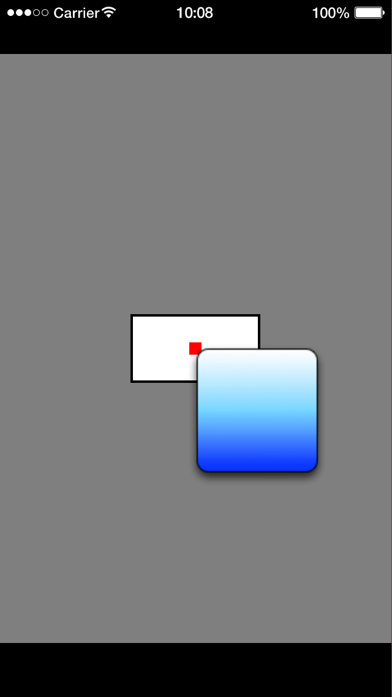 | **background-9slice**: a 9-slice background from an image sheet (Texture Packer) and its drop-shadow offsets, 150x100 and anchored at its bottom-right corner; after a second it's 100 wide and anchored at its top-left (`setAnchor()`). |
| 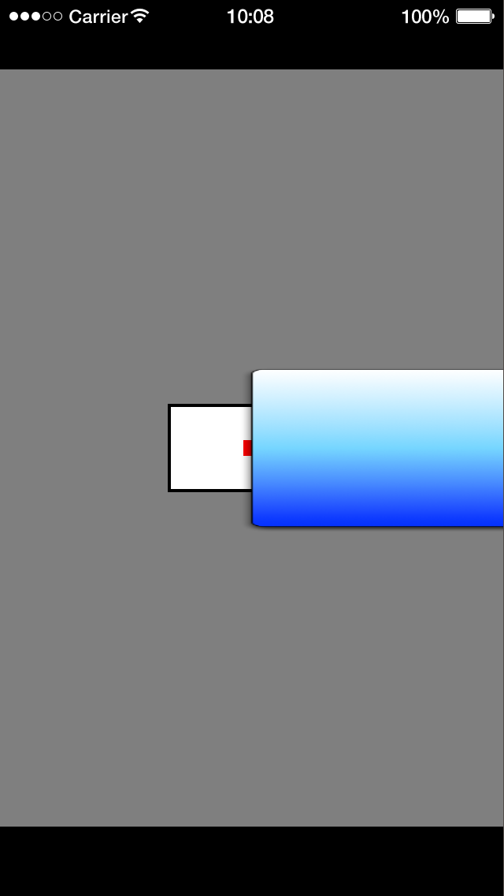 | **background-image**: an image background with its drop-shadow offsets, scaled to 100x100; after a second it's 200 wide (the screenshot), and after two a width and height of 0 show the image at its own size. |
| 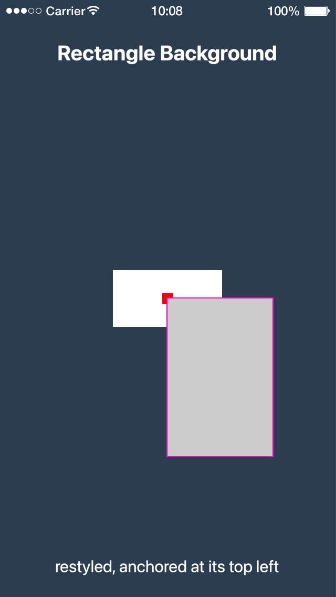 | **background-rectangle**: an orange rectangle background with a red border, anchored at its bottom center; after a second its `viewStyle` makes it grey with a thin pink border, and it's anchored at its top-left. |
| 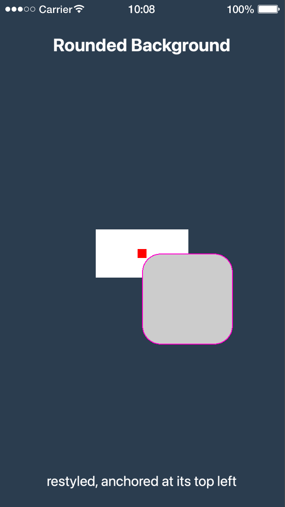 | **background-rounded**: a blue rounded background with a red border, 150x100; after a second it's 100 wide, grey with a thin pink border and a corner radius of 20, anchored at its top-left. |
| 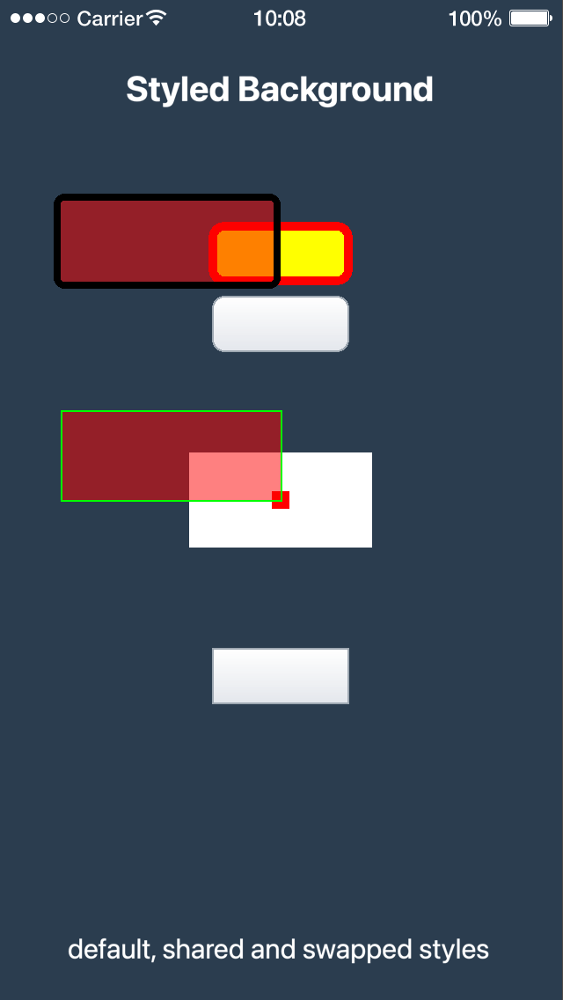 | **background-styled**: styles on backgrounds. Defaults changed through `viewStyle` (the yellow one, then moved up), the default rounded and rectangle backgrounds (grey), a shared style from `newBackgroundStyle()`, and a widget whose style is swapped (rounded, rectangle, rounded again) while it moves up. Their styles set `debugOn=true`, which covers a background in translucent red. |
| 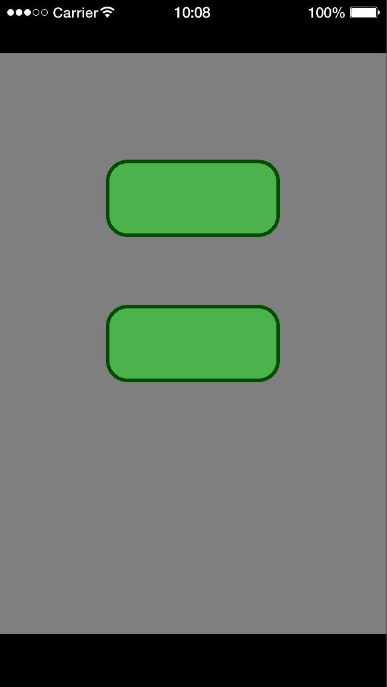 | **background-themed**: three themes in `theme/` (red, green, blue), each with a background style named `home-background`: a rectangle, a rounded and a 9-slice background. Both backgrounds use the style by name, so they change with the active theme, every second (`dUI.loadThemes()`, `dUI.activateTheme()`). The screenshot is the green theme. |
| 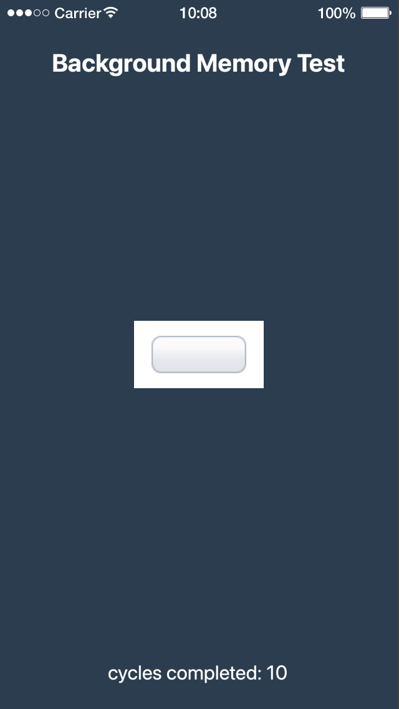 | **background-memtest**: creates and removes a default 9-slice background every 75 ms and prints memory use with [dmc-performance](https://github.com/dmccuskey/dmc-performance); `run_example1()` does the same with a rectangle. Each background is up for about a frame; for the screenshot, one was kept on the screen. |

## Button

| | |
|---|---|
| 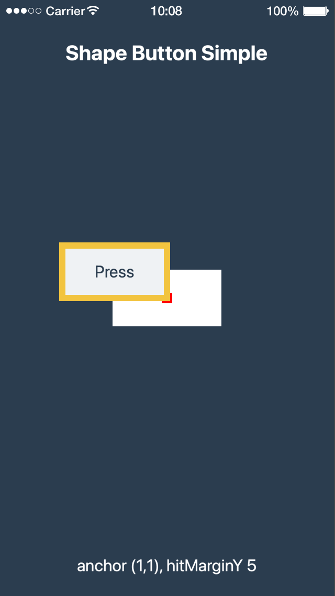 | **button-shape-simple**: a button drawn with shapes, a grey rectangle with a yellow border, a green rounded rectangle while pressed. After a second its anchor becomes (1,0) and its hit margin grows; after two the anchor is (1,1) (the screenshot). `run_example1()` shows the four button types with the default style, `run_example3()` a shared style and `clearStyle()`. |
| 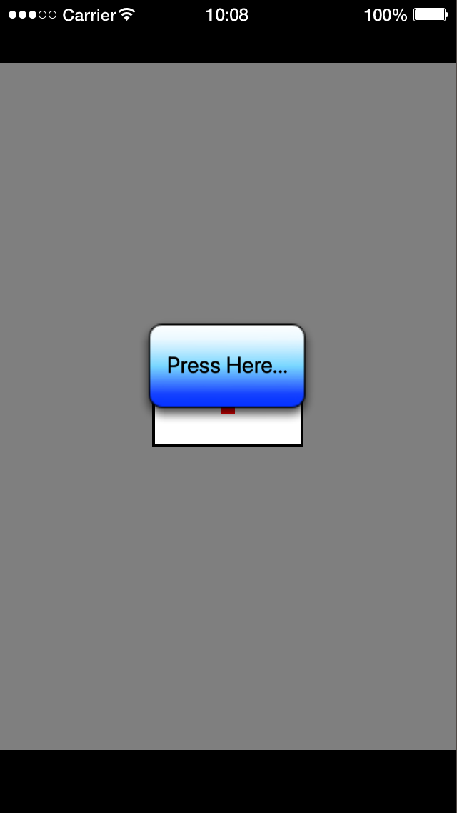 | **button-9slice-simple**: a button with a 9-slice background (an image sheet) anchored at its bottom center. Its size animates between 60x40 and 225x100; when it's narrow, the label "Press Here for Fun" ends in `...` (the screenshot). The pressed state uses the default rounded style. `run_example1a()` is the same button at a fixed size, `run_example3()` adds `debugOn`. |
| 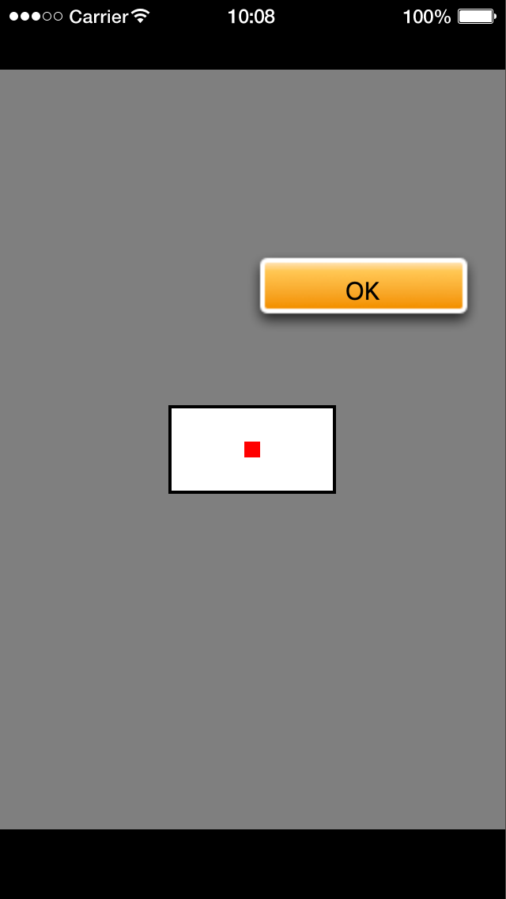 | **button-image-simple**: a button made of two images, orange and a darker orange while pressed. A background `width` and `height` of 0 draws each image at its own size. |
| 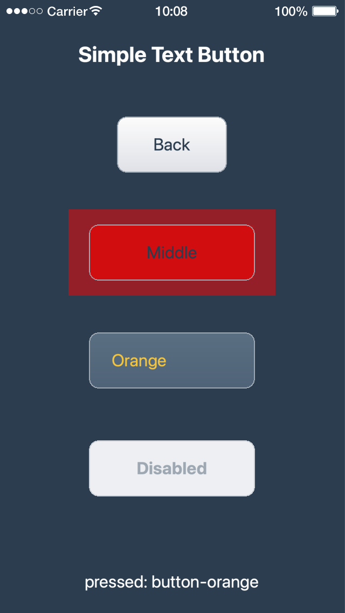 | **button-text-simple**: four push buttons that differ in their label, each state styled on its own: "Back" turns red and moves right while pressed; "Middle" has a hit area larger than the button (`hitMarginX`, `hitMarginY`), shown in red by `debugOn`; "Orange" sits right with an offset and jumps left while pressed (each state's `align`, `offsetX`, `offsetY`; held down in the screenshot); "Disabled" shows the disabled style and ignores presses. |
| 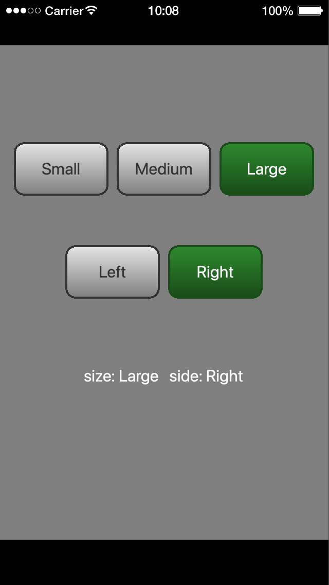 | **button-radio-group**: two button groups (`newButtonGroup()`). In the radio group one of "Small", "Medium" and "Large" is always active; in the toggle group at most one of "Left" and "Right" is, and pressing it again turns it off. The line below shows the selection, from each group's change event. In the screenshot "Large" and "Right" were pressed. |

## ScrollView

| | |
|---|---|
| 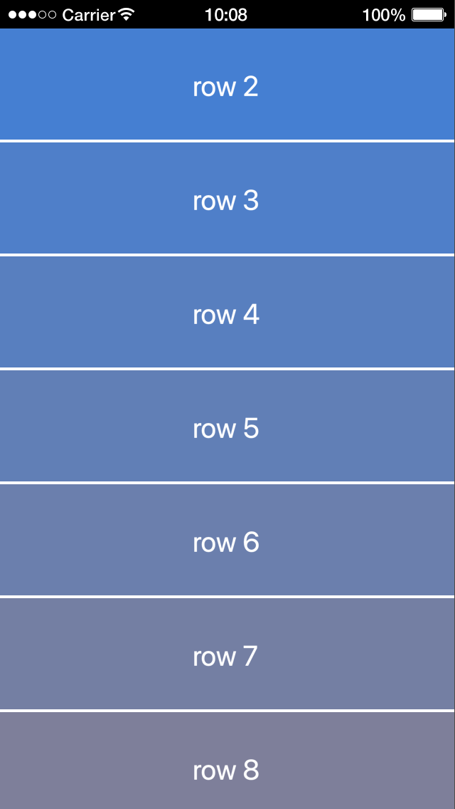 | **scrollview-simple**: a scroll view which fills the screen below the status bar, sized from what the device reports (`dUI.WIDTH`, `dUI.HEIGHT`, `display.topStatusBarContentHeight`), over 20 numbered rows (`NUM_ROWS`, `ROW_HEIGHT`), masked to its size (`autoMask`). Drag or flick it up and down; it bounces at the edges. The rows fit its width, so `horizontalScrollEnabled=false`: content that fits can otherwise still be pulled sideways. After a second it scrolls to row 2 (`setContentPosition()`, the screenshot); after four scrolling is locked (`verticalScrollEnabled`); after eight it is back, and the content rests 10 higher (`upperVerticalOffset`). The scroll indicator on the right shows while the content moves. |
| 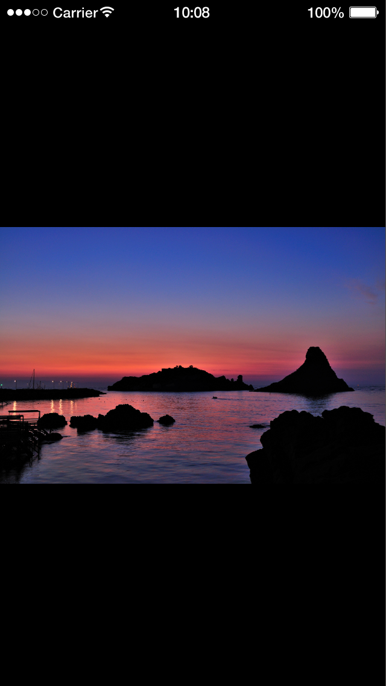 | **scrollview-zoom**: a photo of 1024x680 in a scroll view which fills the screen below the status bar; at full size it scrolls in both directions. The delegate's `getViewForZoom()` names the photo as the object to scale; `minimumZoom` is the scale at which all of it fits, `maximumZoom` twice its size. After a second the app zooms out to show the whole photo (`setZoomScale()`, the screenshot), after four back in to full size; then drag to move around, pinch to zoom (on a device: the Simulator has one touch). Its scroll indicators are light (`indicatorColor` in its style), to show on the dark photo. |
| 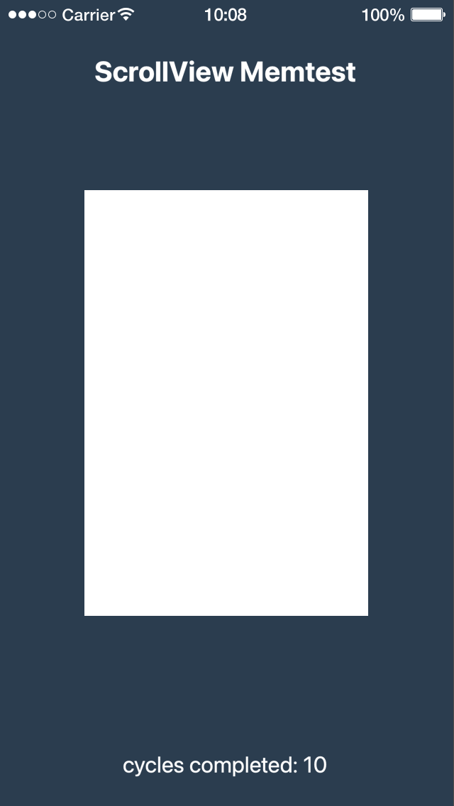 | **scrollview-memtest**: creates an empty scroll view and removes it 200 ms later, over and over, and prints memory use with [dmc-performance](https://github.com/dmccuskey/dmc-performance); `run_example1()` does the same with a scroll view style. |

## TableView

Each table view fills the screen below the status bar, sized from what the device reports (`dUI.WIDTH`, `dUI.HEIGHT`, `display.topStatusBarContentHeight`), and is masked to its size (`autoMask`).

| | |
|---|---|
| 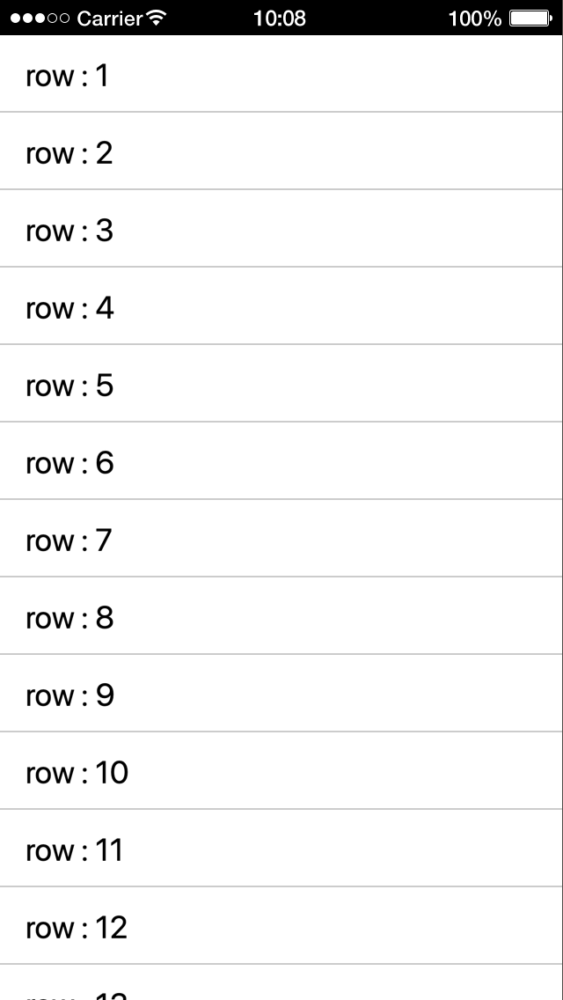 | **tableview-simple**: a list of 50 rows (`NUM_ROWS`, `ROW_HEIGHT`). A delegate supplies them: how many there are (`numberOfRows`), and what a row shows when the table view asks for it (`onRowRender`); only the rows near the screen exist. Drag or flick it up and down; it bounces at the edges, and a scroll indicator shows on the right while it moves. Tap a row and the app prints its number (`didSelectRow`); when the list comes to rest it prints where, and whether that is the top or the bottom (`didEndScrolling`). |
| 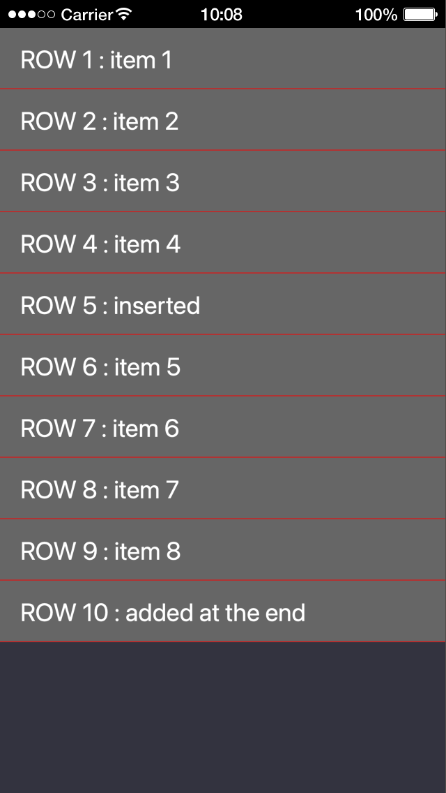 | **tableview-modify**: rows added and removed. The list starts with 8 rows, fewer than fill the view; after two seconds a row is inserted at 5 (`insertRowAt()`), after four another is added below the last one (the screenshot), after six row 5 is removed again (`removeRowAt()`). Each row shows its number and the name of its item, so the rows below a change count up or down. The rows are gray with a red line (`setBackgroundColor()`, `setLineColor()` on the row); below them the table view's own color shows (`fillColor` in its style). |
| 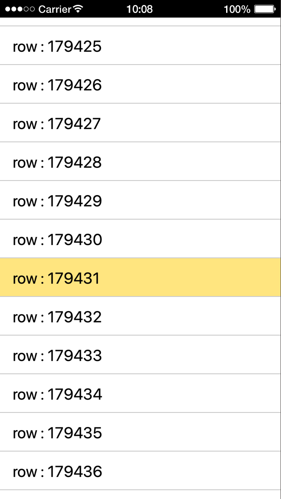 | **tableview-scroll**: a list of 250,000 rows. After a second and a half it scrolls for three seconds until row 179,431 is in the middle of the view (`scrollToRowAt()` with `position='middle'` and a `time`); that row is yellow (the screenshot). On the way the rows pass too fast to read: the table view only makes the ones near the screen. |
| 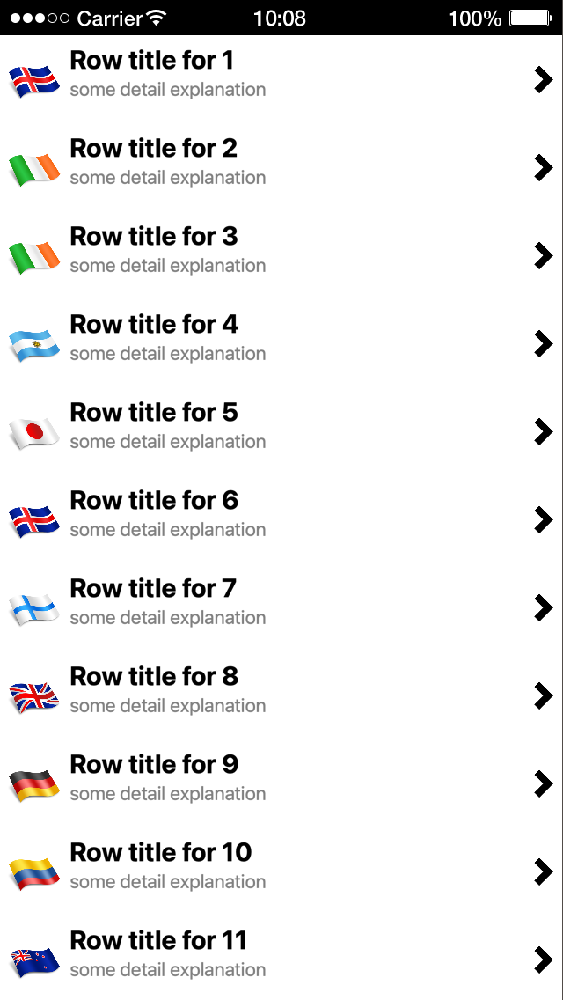 | **tableview-tableviewcell**: `newTableViewCell()` rows, each with a flag (`imageView`), a title and a detail line (the subtitle layout) and a disclosure indicator (the default accessory). One style from `newTableViewCellStyle()` sizes and places the text for rows of 50. The cells are reused: a row which leaves the screen puts its cell in a cache, and the next row to appear takes it. Touch a row and it is highlighted (the style's `active` state); tap it and the app prints its number. |
| 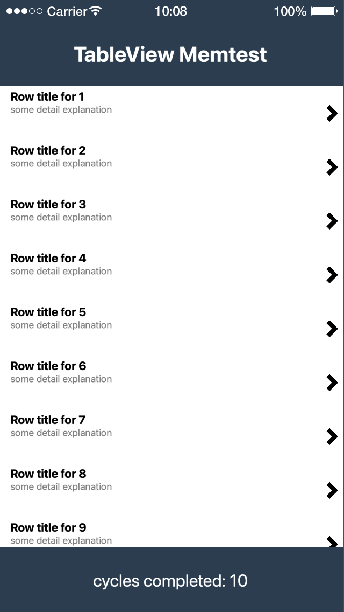 | **tableview-memtest**: creates a table view with TableViewCell rows and removes it 100 ms later, with its cells, over and over, and prints memory use with [dmc-performance](https://github.com/dmccuskey/dmc-performance); `run_example1()` to `3()` do the same with a table view style, a cell style and a single cell. For the screenshot, a table view was kept on the screen. |

## Text

| | |
|---|---|
| 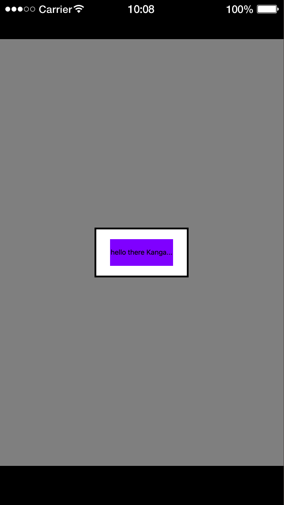 | **text-simple**: a Text whose width animates between 40 and 250. With `fontSizeMinimum`, text that doesn't fit first shrinks, then ends in `...` (the screenshot). It starts sized to its text, which its size event (`DIMENSION_CHANGED`) prints. `run_example1()` to `3()` change properties on a timer, set them back to `nil`, and animate the width with anchors, fonts and colors. |
| 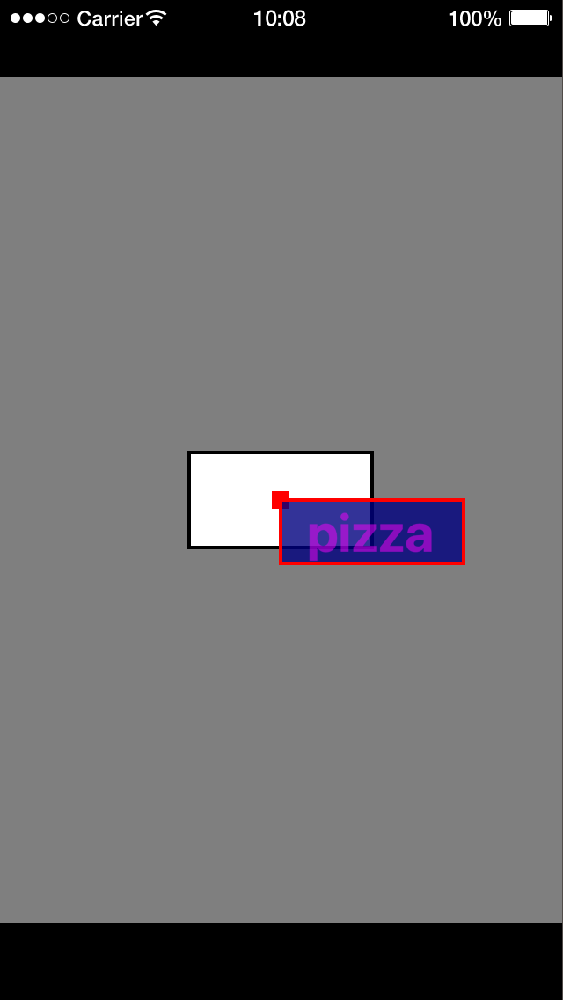 | **text-styled**: an inline style, then the default style (`style=nil`); after two seconds "hamburger" in a 300x70 box anchored at its bottom-right, then "pizza" sized to its text and anchored at its top-left (the screenshot). `run_example1()` to `6()` show the default style, shared and named styles, `clearStyle()` and long text. |
| 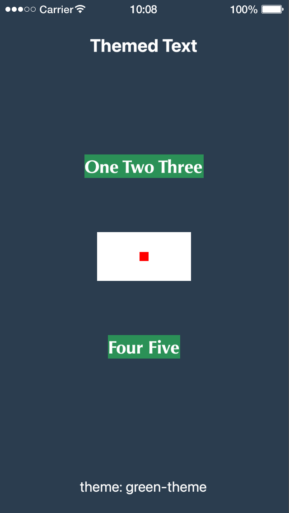 | **text-themed**: three themes in `theme/` (red, green, blue), each with a text style named `home-text`. Both Texts use the style by name, so they change with the active theme, every second (`dUI.loadThemes()`, `dUI.activateTheme()`). The screenshot is the green theme. |
| 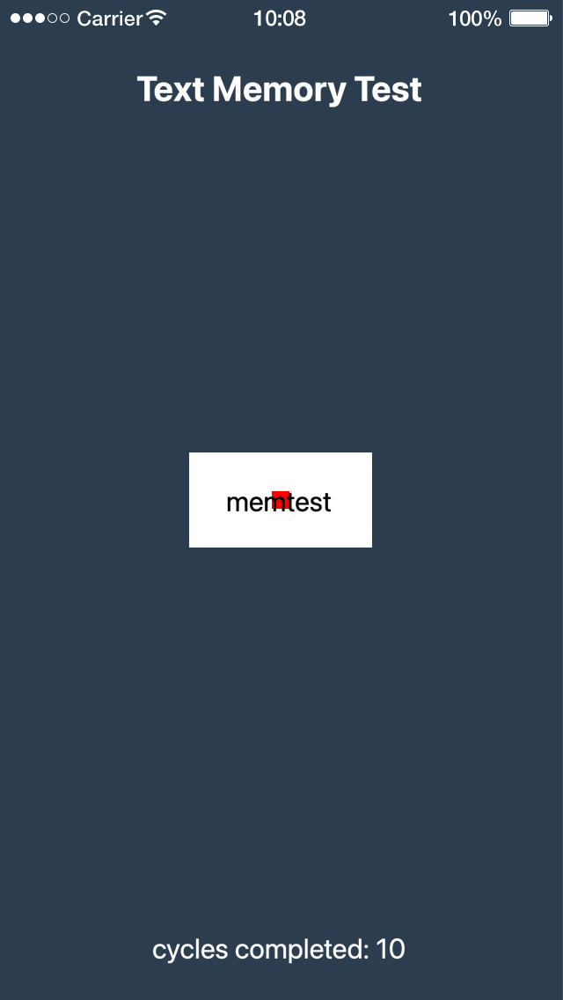 | **text-memtest**: creates and removes a Text every 50 ms and prints memory use with [dmc-performance](https://github.com/dmccuskey/dmc-performance); `run_example1()` and `2()` do the same with a text style (new, and `copyStyle()`). Each Text is up for about a frame; for the screenshot, one was kept on the screen. |

## TextField

| | |
|---|---|
| 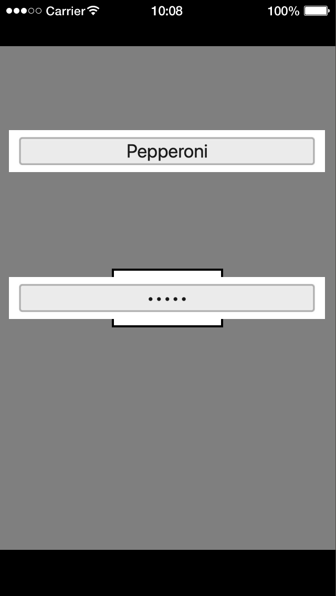 | **textfield-simple**: two fields in the default style, "Pizza Topping:" and a secure "Secret Ingredient:" whose text shows as dots. Tap one to edit it in a native field; when editing ends, the field shows the text and the app prints it. In the screenshot both were filled in ("Pepperoni" and "basil"). The default skin is drawn for a white page: on this gray one, its white edges show. `run_example2()` gives a field a style object, then a second later changes the style (size, anchor) and the field (margin, colors, align, `isSecure`). |
| 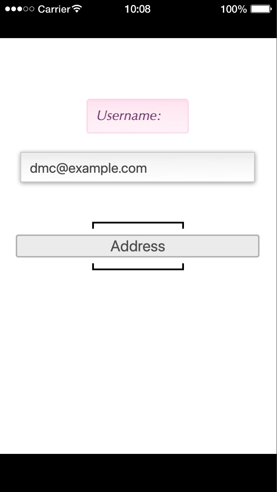 | **textfield-styled**: three styles. "Username:" has a pink 9-slice background and an italic purple hint; its width animates between 270 and 60 (narrowing in the screenshot), and the native field follows. "Email" has a shadowed 9-slice background, the hint on the right, the text on the left (filled in for the screenshot) and the email keyboard. "Address" uses the default style. |
| 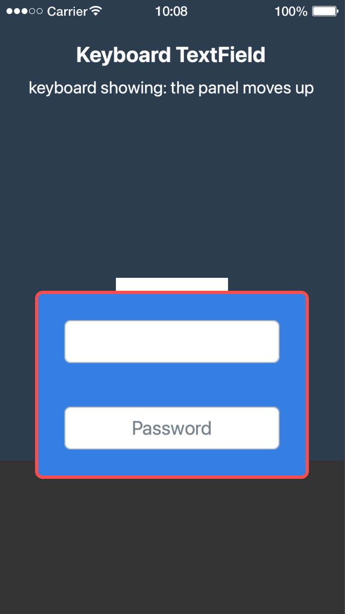 | **textfield-keyboard**: "Email" and a secure "Password" in a panel low on the screen; the dark gray bar stands in for the keyboard, where dUI expects it. When a field takes the focus, `dUI.KEYBOARD_SHOWING` slides the panel up (`dUI.adjustForKeyboard()`) until "Password" is 10 above the keyboard; `KEYBOARD_HIDING` slides it back. In the screenshot "Email" is being edited. |
